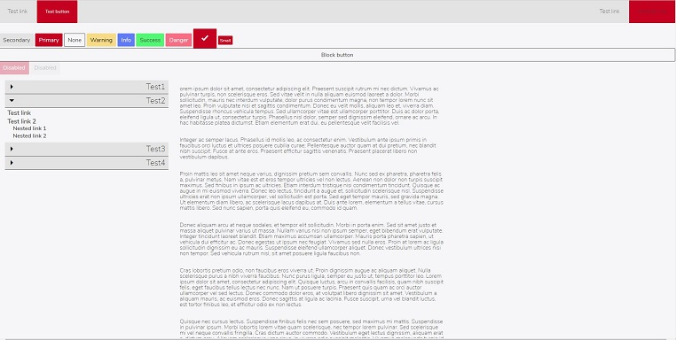

# BlazUI

UI library for Blazor projects. Focused on supporting internal/desktop web applications.

## Supported components

List of components supported by BlazUI:

- NavBar
- Buttons
- Modal
- List
- Accordion
- Columns

## Installation

Work in Progress - Nuget package will be prepared in future.

## Usage

Work in Progress...

## Contributing
Pull requests are welcome. For major changes, please open an issue first to discuss what you would like to change.

## License
[MIT](https://choosealicense.com/licenses/mit/)